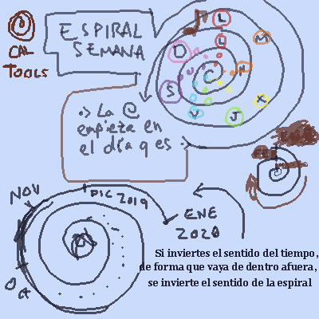

Una serie de herramientas para tener calendarios chulos.

---

## Popurrí:

### Asociaciones color/sonido a día de la semana

|Dia		|  Nota	| Color|
|---|---|---|
| Lunes		| Do	| Rojo |
| Martes		| Re	| Naranja |
| Miercoles		| Mi	| Amarillo |
| Jueves		| Fa	| Verde |
| Viernes		| Sol	| Azul |
| Sabado		| La	| Purpura |
|Domingo		| Si	| Rosa |

### Espiral de tiempo multiescala

En realidad la espiral es siempre la misma, lo que cambia es la escala en que aparecen las medidas de tiempo.

Segundo - Minuto - Hora - 12h - Dia - Semana - Mes - Año - Lustro - Década - 50a - Siglo
1 - 60 - 60 - 12 - 24 - 7 - 4 - 12 - 5 - 2 - 5 - 2

Debería poder cambiarse la escala eligiendo medidas. Otros ejemplos:

S - M - H - D - S - A - D
1 - 60 - 60 - 24 - 7 - 52 - 10

S - m - 30m - H - D - M - A - S
1 - 60 - 30 - 2 - 24 - 30 - 12 - 100

Claro que cuantos más elijas, menos espacio tienes en la espiral. Para que quepa todo en la misma sin _scroll_ habría que poner un límite. Meterle _Scroll_ puede ser complicado.

Si sólo eliges una opción entonces la espiral se convierte en una curva a lo muelle:

 